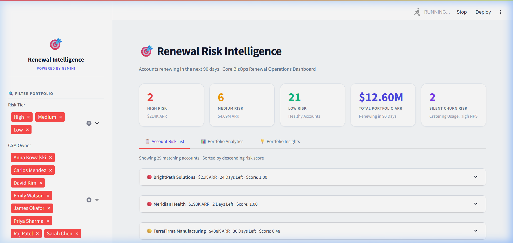
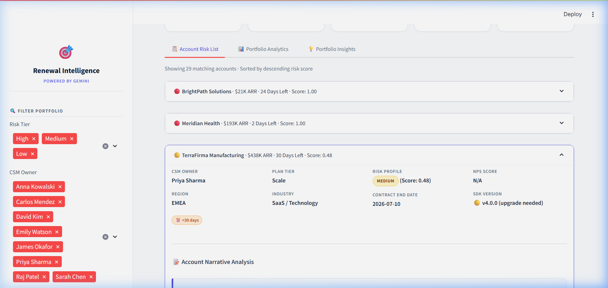
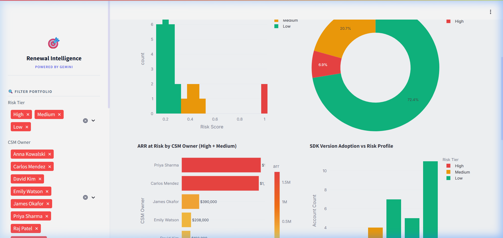
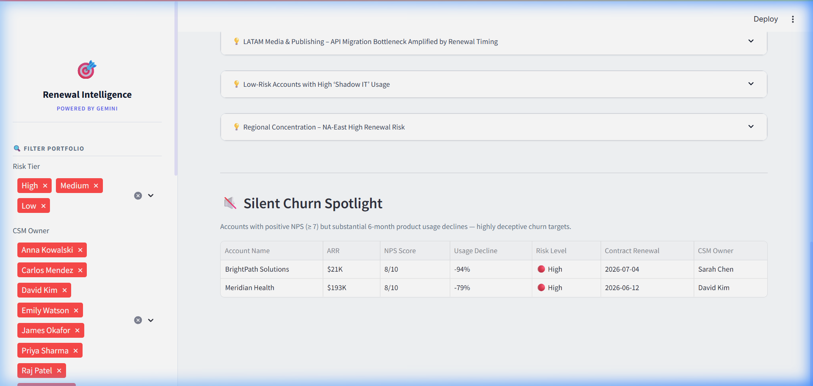

# 🎯 Renewal Intelligence Engine
A production-quality renewal risk intelligence and explanation platform for CS and BizOps teams. It ingests messy, multi-modal account signals (product usage, support tickets, survey data, CSM call notes, changelogs), runs a weighted multi-signal scoring algorithm, and integrates both **Gemini AI** and **local Ollama models** to generate actionable, plain-English risk narratives and surface non-obvious portfolio insights.

---

## 📸 Visual Showcase

### 1. Dashboard Home
A premium, Tailwind-inspired light interface displaying structured KPI cards, filters, and risk distributions.


### 2. Deep-Dive Account Analysis & AI Narratives
Clicking any card expands it to reveal inline metadata grids, AI-generated risk narrative callouts, action checklists, NPS comment translation bubbles, and custom HTML progress bars for signal contributions.


### 3. Portfolio Analytics
Interactive Plotly charts, illustrating risk distributions, CSM portfolios, SDK migrations, and ARR risk scatter bubbles.


### 4. Interactive Silent Churn Spotlight
An interactive, filterable grid highlighting accounts with high NPS (≥ 7) but significant product usage declines—the most deceptive churn pattern.


---

## ⚡ Quick Start

### 1. Install Dependencies
```bash
pip install -r requirements.txt
```

### 2. Configure Environment Variables
Create a `.env` file inside the `src/` directory (or project root):
```bash
cp .env.example .env
```
Inside your `.env`, configure your preferred LLM provider:
```env
# --- Gemini Configuration (Cloud) ---
LLM_PROVIDER=gemini
GEMINI_API_KEY=your_gemini_api_key_here

# --- Ollama Configuration (Local / Offline) ---
# LLM_PROVIDER=ollama
# OLLAMA_MODEL=gemma3:4b
# OLLAMA_HOST=http://localhost:11434
```

### 3. Run Ingestion and Analysis Pipeline
This reads the raw datasets, calculates risk scores, performs LLM sentiment and narrative generation, and saves the final output report to `output/risk_report.json`.
```bash
python pipeline.py
```
*Tip: To perform incremental runs or resume interrupted processes without losing progress, use:*
```bash
python enrich_report.py
```

### 4. Launch the Streamlit Dashboard
```bash
streamlit run app.py
```

---

## 🛠️ System Architecture

```
                       [Messy CSV & Raw Notes Data]
                                    │
                                    ▼
       ┌────────────────────────────────────────────────────────┐
       │ Ingestion & Fuzzy Reconciliation (data_loader.py)      │
       │   • Normalizes 6 date formats via Regex parsing        │
       │   • Fuzzy-matches CSM accounts with RapidFuzz          │
       └────────────────────────────┬───────────────────────────┘
                                    │
                                    ▼
       ┌────────────────────────────────────────────────────────┐
       │ Feature Engineering & Signal Engine (feature_engine.py)│
       │   • Computes 6-month product usage trend slopes        │
       │   • Weights ticket resolution and burden scores        │
       └────────────────────────────┬───────────────────────────┘
                                    │
                                    ▼
       ┌────────────────────────────────────────────────────────┐
       │ Risk Scoring Rules Engine (risk_scorer.py)             │
       │   • Multi-signal composite weighted risk scoring       │
       │   • Integrates binary risk boosters (e.g. silent churn)│
       └────────────────────────────┬───────────────────────────┘
                                    │
                                    ▼
       ┌────────────────────────────────────────────────────────┐
       │ LLM Analyst & Multi-Provider Router (llm_analyst.py)   │
       │   • Handles prompts for Sentiment, Translation, & Logs │
       │   • Routes requests to Gemini API or local Ollama      │
       └────────────────────────────┬───────────────────────────┘
                                    │
                                    ▼
                      [Streamlit Dashboard (app.py)]
```

### Key Submodules:
- `src/data_loader.py`: Ingests and merges datasets. Uses `rapidfuzz` (`token_set_ratio`, cutoff=55) to align typos (e.g., "BritePath" -> "BrightPath Solutions") and a multi-pattern regex parser to read 6 inconsistent date formats.
- `src/feature_engine.py`: Normalizes ticket burden, extracts NPS survey scores, detects sunset SDK usage, and calculates product metrics.
- `src/risk_scorer.py`: Computes a 0.0 to 1.0 composite risk score using weighted parameters and applies stacking binary risk boosters (+0.10 for open P1s, +0.10 for silent churn).
- `src/llm_analyst.py`: Handles all LLM calls. Implements a robust `_parse_json` utility that cleans local LLM outputs (resolving trailing commas, conversational preambles, and code-fence issues).
- `enrich_report.py`: Interacts with the risk report. Performs checkpoint-saving by immediately updating `output/risk_report.json` after *every successful LLM request*, enabling seamless resume capabilities if interrupted.

---

## 🦙 Local Execution (Ollama Integration)
To completely bypass Gemini API rate limits, run the LLM tasks locally on your own computer:

1. **Install Ollama**: Download it from [ollama.com](https://ollama.com).
2. **Download Model**: Run your model of choice (e.g., `gemma3:4b` or `gemma2`):
   ```bash
   ollama run gemma3:4b
   ```
3. **Configure Environment**: Update your `.env` file:
   ```env
   LLM_PROVIDER=ollama
   OLLAMA_MODEL=gemma3:4b
   OLLAMA_HOST=http://localhost:11434
   ```
*Note: In local mode, the pipeline automatically disables rate-limiting sleep cycles, processing the dataset in a fraction of the time.*

---

## 📈 Risk Scoring Weights

| Signal Component | Weight | Rationale |
|---|---|---|
| **Product Usage Decline** | 25% | Linear regression slope over 6 months of API activity (leading indicator). |
| **Support Ticket Burden** | 20% | Open/escalated P1 tickets indicate active implementation pain. |
| **NPS detractor score** | 15% | Quantitative rating of customer dissatisfaction. |
| **SDK sunset risk** | 15% | Structural threat: technical cliff for legacy v3.x integrations. |
| **CSM sentiment score** | 15% | LLM-extracted qualitative sentiment from recent CS notes. |
| **Renewal urgency** | 10% | Proximity multiplier (<30 days till renewal). |

### Stacking Binary Boosters:
- **+0.10**: Active, open P1 tickets.
- **+0.10**: "Silent Churn" pattern (Positive NPS score ≥ 7 but declining product usage).
- **+0.08**: SDK version on critical sunset-sunset v3.x.

---

## 🏆 Non-Obvious Insights Surfaced
- **Silent Churn**: Identifies accounts like Meridian Health (NPS 8, usage drop of 40%) that a simple Detractor-only rule misses.
- **Foreign Language NPS Translation**: Translates and analyzes sentiment for non-English NPS entries (Spanish, Mandarin, French), matching them with CSM signals.
- **Relationship Risks**: Extracts qualitative champion departures (e.g., key advocate leaving) from unstructured CSM call notes.
- **Regulatory Collisions**: Flags soft compliance deadlines (e.g., security questionnaire dates, single-tenant hosting demands) buried in call notes.

---

## 🛠️ Production Roadmap
1. **Secrets Management**: Replace local `.env` storage with AWS Secrets Manager or HashiCorp Vault.
2. **Database Integration**: Write output report matrices into PostgreSQL / Amazon Redshift instead of flat JSON.
3. **LLM Observability**: Introduce logging and tracing (e.g., Arize Phoenix, Langfuse) to track LLM cost, latency, and drift.
4. **Scheduled Ingestion**: Run pipeline triggers via an orchestrator (Apache Airflow / Prefect) pulling directly from live Salesforce/Gainsight integrations.
